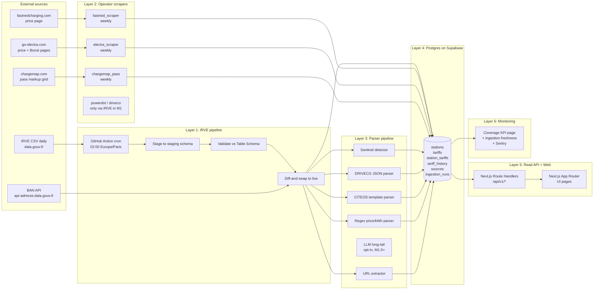

# Phase 2 — Architecture

> Plan, not code. Builds on `docs/01-discovery.md` and your six Phase-1 answers.
> Date: 2026-05-02.
> Stack premise (per your direction): Next.js (App Router) + Supabase + Vercel, justified against the 224k-row daily ingestion in §3.
> Operating principle: **honesty is the product.** Provenance and freshness are first-class data, not metadata.

---

## §1 — Data Model

OCPI 2.2.1 vocabulary inside, French/IRVE vocabulary at the seams. Postgres on Supabase. JSONB used sparingly, only for the raw upstream payload of each tariff (audit trail for parser regressions).

### 1.1 Entity overview

```
operators ──┐
            ├── networks ── stations ── charge_points
            │                  │
            │                  └── station_tariffs ──┐
            │                                        │
payment_methods ─┐                                   │
                 ├── tariffs ── tariff_elements ── price_components
subscriptions ───┤              │                                  │
                 │              └── tariff_restrictions             │
pass_markups ────┘                                                  │
                                                                    │
sources ────────────────────────────────────────────────────────────┘
                              │
                              └── ingestion_runs ── parser_outcomes ── community_reports (M3)
```

### 1.2 Tables (concise definitions)

**Identity**
- `operators` — canonical brand. Resolves the dataset's enseigne duplicates ("LIDL" / "Lidl France", "Tesla" / "TESLA SUPERCHARGER"). Fields: `id, slug, display_name, country, website_url, logo_url, default_payment_methods[]`.
- `networks` — a sub-network within an operator (e.g. "TotalEnergies Charge Rapide"). FK `operator_id`. Useful when an operator runs distinct tariff regimes.
- `stations` — physical site. PK = `id_station_itinerance` (per Phase-1 Q9). FK `operator_id`, `network_id`. Geometry as `GEOGRAPHY(Point, 4326)` (PostGIS) for `<-> ` distance queries. Address fields and `consolidated_code_postal` retained; `last_seen_in_irve_at` for de-listing.
- `charge_points` — one connector. PK = `id_pdc_itinerance`. FK `station_id`, `power_kw`, socket booleans (CCS/Type2/CHAdeMO/EF/other), `cable_attached`.

**Pricing**
- `payment_methods` — enum-ish lookup: `cb_ad_hoc`, `operator_app`, `operator_subscription`, `roaming_pass`. Plus a polymorphic FK to either `subscriptions` or `pass_markups` when applicable.
- `subscriptions` — operator-side recurring plan. Fields: `id, operator_id, slug, display_name, monthly_fee_eur, yearly_fee_eur, currency, last_verified_at`. Examples: "Electra+ Boost €9.99/mo", "Fastned Gold €11.99/mo", "Ionity Power 365 €119.99/yr".
- `pass_markups` — pass-side multiplier table. Fields: `id, pass_id (FK pass_providers), target_operator_id, multiplier_pct, flat_fee_eur, last_verified_at`. Per Phase-1 Q4 we only model the *grid*, not full pass station data.
- `pass_providers` — Chargemap, Shell Recharge, Plugsurfing, KiWhi/Fulli.
- `tariffs` — OCPI Tariff. FK `operator_id`, `payment_method_id`, `currency` (default EUR), `tax_included` enum, `min_price`, `max_price`, `start_date_time`, `end_date_time`, `last_updated`. The OCPI `type` (REGULAR / AD_HOC_PAYMENT / PROFILE_*) is derived from `payment_method_id` rather than stored.
- `tariff_elements` — FK `tariff_id`.
- `price_components` — FK `tariff_element_id`. `type` enum (ENERGY / FLAT / TIME / PARKING_TIME), `price`, `vat`, `step_size`.
- `tariff_restrictions` — FK `tariff_element_id`. Mirrors OCPI restrictions verbatim (start_time, end_time, day_of_week, min_kwh, max_kwh, min_power, max_power, min_duration, max_duration).

**Provenance & freshness — the UX pillar**
- `sources` — registry of every upstream data source. Rows: `irve_consolidated`, `power_dot_scraper`, `driveco_irve_json`, `citeos_template_parser`, `fastned_scraper`, `electra_scraper`, `chargemap_pass_markup_scraper`, `community_report` (M3), etc. Fields: `id, slug, kind` (`open_data` | `operator_scrape` | `parsed_irve_field` | `community`), `default_confidence`, `is_enabled` (feature flag), `last_run_at`, `last_run_status`, `notes_url`.
- `station_tariffs` — the **only** join from a station to its applicable tariff. **This is where confidence lives.** One row per (`station_id`, `payment_method_id`, `source_id`, `valid_from`).
  - `confidence` — enum: `verified` | `parsed` | `estimated` | `unknown`
  - `last_verified_at` — when did this tariff last match the source
  - `last_seen_at` — when did we last successfully fetch the source (different from above: a stable scrape that returns the same value bumps `last_seen_at` only)
  - `parser_version` — semver of the parser that emitted this row, for regression audit
  - `raw_value` — JSONB of the original upstream payload (the IRVE `tarification` text, the scraped HTML fragment, etc.) — for parser regression replay
  - `tariff_id` — FK; null if `confidence='unknown'`
- `tariff_history` — append-only snapshot table. Trigger on `station_tariffs` UPDATE writes the previous row here. M2 surfaces this as price-history charts; in M1 it's just collected.
- `ingestion_runs` — one row per scheduled job execution. `source_id, started_at, ended_at, status, rows_processed, rows_inserted, rows_changed, error_message`. Powers the freshness dashboard.
- `parser_outcomes` — audit table. One row per IRVE row processed by the parser pipeline. `irve_pdc_id, parser_chain_used, output_confidence, raw_input_hash, parser_version, processed_at`. Enables "did parser v0.4.1 regress on the CITEOS templates?" replays without re-downloading the CSV.
- `community_reports` — schema only in v1 (per Phase-1 Q6). `station_id, payment_method_id, reported_price_eur_per_kwh, reported_at, user_session_hash, status` (`pending`|`accepted`|`rejected`). No UI surface in v1.

### 1.3 Confidence tier propagation — DB → API → UI

This is the most important diagram in the doc. The 4-tier moves through three transforms without losing meaning.

```
DB layer (station_tariffs.confidence)
    │
    │ 'verified' | 'parsed' | 'estimated' | 'unknown'
    ▼
API layer (GET /api/v1/stations/:id)
    │
    │ {
    │   "tariffs": [{
    │     "payment_method": "cb_ad_hoc",
    │     "price_per_kwh_eur": 0.61,
    │     "confidence": "verified",
    │     "source": { "slug": "fastned_scraper", "kind": "operator_scrape" },
    │     "last_verified_at": "2026-05-01T03:14:00Z",
    │     "raw_value_url": "/api/v1/raw/abc123"   // for the curious
    │   }, ...],
    │   "coverage_summary": { "verified": 1, "parsed": 0, "estimated": 0, "unknown": 0 }
    │ }
    ▼
UI layer (per-row badge + sort key)
    │
    │   ✅ Vérifié      green   — direct operator scrape, < 7 days old
    │   📄 Estimé IRVE  amber   — parsed from the official dataset's free-text field
    │   📊 Moyenne      grey    — network-level fallback estimate
    │   ❓ Non communiqué orange — we have no number; here's the operator link
    │
    │ Default sort: verified > parsed > estimated > unknown, then by price ascending.
    │ Unknown rows collapse to a single line: "47 autres bornes sans tarif communiqué"
    ▼
User
```

**Invariant.** A `station_tariffs` row with `confidence='unknown'` MUST have `tariff_id IS NULL` and MUST NOT contribute a number to any aggregate. Enforced by a CHECK constraint and by the API serializer. This protects against the failure mode where a confident-looking number sneaks into a "we don't know" column.

### 1.4 Why this shape (vs alternatives considered)

- **Why a join table (`station_tariffs`) instead of `tariff.station_id`?** A given station has different tariffs per payment method (CB direct vs Electra+ vs Chargemap pass), and the same tariff may apply to many stations of one operator. Many-to-many with a confidence-bearing join is the natural shape and matches OCPI's separation of Locations and Tariffs.
- **Why store `raw_value` JSONB?** Parser regressions are inevitable. Without the raw, we'd have to re-download 150 MB to re-parse one bad pattern. With it, one SQL query replays the parser locally.
- **Why not fold `confidence` into `tariff_elements`?** Because confidence is about *the link from a station to a tariff*, not about the tariff's structure. A perfectly correct OCPI tariff can be applied to a station with low confidence (e.g. via a network-average estimate).
- **Why PostGIS instead of plain lat/lon columns?** The default UX query is "stations near address X." `ST_DWithin` on a `GEOGRAPHY` index is two orders of magnitude faster than haversine on float columns at our row count.

---

## §2 — System Architecture

The single-most-important architectural rule from your direction: **a broken scraper must never block IRVE sync.** Strict layered isolation, each layer with its own deployment unit and its own kill switch.

### 2.1 Layered diagram



### 2.2 Layer 1 — IRVE ingestion (the spine; must never break)

**Why GitHub Actions and not a Vercel function?** A 151 MB CSV download + parse + Postgres COPY routinely runs 90–180 s. Vercel functions cap at 300 s and bill on Active CPU; GitHub Actions runners give us 6 hours, free for public repos, with first-class job logs. The pipeline is also slow-feedback by nature — Cron Jobs in CI are the right primitive. The function tier on Vercel is reserved for the user-facing read path.

**Algorithm.**
1. Pull the CSV from the canonical resource ID (`eb76d20a-8501-400e-b336-d85724de5435`). Verify Content-Length and SHA hash against the previous run; abort early on no-change.
2. Stream-parse into a `staging.irve_*` schema (separate Postgres schema). Use Postgres `COPY ... FROM STDIN` for throughput.
3. Validate against the IRVE Table Schema (v2.3.0). Per-row validation errors logged but not fatal — IRVE itself ships with violations (Phase 1 found `"TRUE"` in a String field).
4. For rows with empty `consolidated_code_postal` (42% of dataset), batch-call the BAN API (`/reverse?lon=…&lat=…`, 100 rows per batch, free, no key). Cache by `id_pdc_itinerance`.
5. Run the parser pipeline (Layer 3) over each new/changed `tarification` value and write `parser_outcomes` rows.
6. **Diff-and-swap**, not truncate-and-reload: compute UPSERT to `public.stations`, `public.charge_points`, and a flagged delete for rows missing this run. `station_tariffs` rows from `irve_consolidated` source are upserted; their `last_seen_at` bumped.
7. Trigger fires on UPDATE to `station_tariffs` → row goes to `tariff_history`.
8. Write one `ingestion_runs` row with status, counts, durations.

**Failure modes and mitigations.**
- *Upstream CSV unavailable.* Job retries 3× over 30 min, then fails loud → Sentry → user-visible banner "données IRVE non rafraîchies depuis Xj." The site keeps serving the previous snapshot.
- *Schema drift (new column, renamed column).* Validation fails-soft per column; unknown columns are stored in a `raw_extra` JSONB. We learn about drift without breaking.
- *Postgres write timeout.* COPY into staging is atomic per chunk; the diff-and-swap only commits when staging is fully populated. A partial run leaves the live tables untouched.

### 2.3 Layer 2 — Per-operator scrapers (small, fragile, isolated)

**Each scraper is a separate Vercel Cron job** — distinct file under `app/api/cron/scrape-<operator>/route.ts`, distinct schedule, **its own row in `sources` with `is_enabled` as a kill switch**, its own retry policy. They share a small `scraper-runtime` lib but no runtime state. The Vercel function timeout (now 300 s default per the platform reminder) is comfortably above what any scraper of this size needs.

**Per-operator profile (M1 + M1.5):**

| Scraper | Source URL | Cadence | Output | Notes |
|---|---|---|---|---|
| `fastned_scraper` | https://www.fastnedcharging.com/en/charging/tariffs + /hq/en/charge-price-changes | weekly Mon 04:00 | one tariff per (country, payment_method) pair | Reference impl — clean HTML, public price-changes log. Robots permissive. |
| `electra_scraper` | https://www.go-electra.com/en/price/ + /en/electra-plus/ | weekly Mon 04:00 | base CB grid + Boost/Start grid | Per Q7 add-on. Skip the dynamic per-station signal in M1; capture only the published floor. Robots permissive. |
| `chargemap_pass_scraper` | https://chargemap.com/en-us/price (pass markup grid only) | weekly Mon 05:00 | rows in `pass_markups` | Strictly the grid. NOT station data (their robots.txt blocks generic UAs). |
| Power Dot, DRIVECO | (none) | — | come via IRVE in M1 | DRIVECO publishes JSON in IRVE `tarification`; Power Dot data is in IRVE. No scraper needed in M1; a v2 scraper opens richer per-station data. |

**Failure isolation.** Each scraper writes only its own `source_id` rows. A scraper raising = `ingestion_runs.status='failed'` for that source only. The freshness dashboard (Layer 6) shows the gap; the UI shows existing data with a stale flag if `last_verified_at` is older than 14 days.

**Operational kill switch.** Setting `sources.is_enabled = false` causes the scraper's cron handler to return early with `{skipped: true}`. Used when an operator changes their HTML and the parse breaks: we disable, ship a fix, re-enable.

### 2.4 Layer 3 — Parser pipeline

Pure functions, no I/O, dispatched by the IRVE ingestion. **Chained, not branched**: a value tries `P0` then `P1` then `P2` then `P3`; the first non-null result wins. `P5` (sentinel) runs first and short-circuits to `confidence='unknown'`.

```
raw `tarification` text
        │
        ▼
P5 sentinel?  ─── yes ───► station_tariffs.confidence = 'unknown', tariff_id = NULL
        │ no
        ▼
P0 DRIVECO JSON?   ─── yes ───► parse, confidence = 'parsed'
        │ no
        ▼
P1 CITEOS template? ─── yes ───► parse (one grammar fits all 65 distinct values), confidence = 'parsed'
        │ no
        ▼
P2 €/kWh regex?    ─── yes ───► parse, confidence = 'parsed'
        │ no
        ▼
P3 URL only?       ─── yes ───► extract URL, confidence = 'unknown', store URL in station notes
        │ no
        ▼
P4 LLM long-tail (M1.5+, optional, costs €€)
        │ no
        ▼
default: confidence = 'unknown'
```

**Test data.** The `.cache/irve.csv` from Phase 1 + a `tests/fixtures/tarification-corpus/` checked-in subset of representative samples (rotated quarterly to follow real drift). Every parser has fixture-based tests. `parser_outcomes` rows in production let us replay the entire 224k-row corpus on every parser change locally.

### 2.5 Layer 4 — Postgres on Supabase

Single Postgres database, three schemas: `public` (live), `staging` (per-run scratch), `archive` (history snapshots). PostGIS for distance queries. All schema changes via migrations checked into the repo (Drizzle or Supabase CLI; pick in Phase 3).

### 2.6 Layer 5 — Read API + Web

Next.js App Router on Vercel.
- **Read API** under `app/api/v1/` — typed, documented, rate-limited (per Q11, deferred to specific number in Phase 3). M1 ships the API endpoints used by the web UI; M2 promotes them to public. No M1 internal/external split — same endpoints, just no public docs page yet.
- **Web** — Server Components by default. Address search as a Server Action calling BAN; results page renders Server-side from Postgres for speed.

### 2.7 Layer 6 — Monitoring & coverage

- **Public coverage page** (per Phase-1 Q1): `/qualite-des-donnees` showing live `verified / parsed / estimated / unknown` percentages globally and per operator. Single page, no auth, doubles as our trust signal AND as social pressure on operators.
- **Internal freshness dashboard**: `/admin/sources` — last run times, success rates, row deltas per source. Behind Supabase Auth (only operator emails).
- **Sentry** for uncaught errors in the cron handlers.
- **Vercel Analytics** for traffic. No PII, no third-party trackers, no cookies.

---

## §3 — Tech Stack

### 3.1 Choices and justification

| Layer | Choice | Why this, vs alternatives |
|---|---|---|
| Web framework | **Next.js 15+ App Router** | RSC + Server Actions + edge caching make the read path effectively free. Your existing strong stack. |
| Hosting | **Vercel** (Hobby → Pro when needed) | Native Next.js, Cron Jobs, 300 s function timeout, Edge Cache, integrated Sentry/Analytics. |
| Database | **Supabase Postgres** | Postgres + PostGIS + Row Level Security + storage + auth in one. Phase-1 reminder note: Vercel Postgres is gone; Supabase or Neon are the replacements. |
| Spatial | **PostGIS** (Supabase enables on demand) | `ST_DWithin` on `GEOGRAPHY` is essentially free at our row count. |
| Geocoding | **BAN API** (api-adresse.data.gouv.fr) | Per your direction. Free, French, no key, batch-friendly. No Google Maps. |
| Daily IRVE sync | **GitHub Actions** (not Vercel function) | The CSV pipeline doesn't fit cleanly inside a 300 s function. GitHub gives us 6 h, free for public repos, first-class logs and re-run UI. Vercel Queues (still beta per platform reminder) is a future option but not for v1. |
| Scrapers | **Vercel Cron Jobs** | Each scraper is a small route handler; cleanly within 300 s. Crons live in `vercel.ts`. |
| ORM | **Drizzle ORM** | TypeScript-native, lightweight, plays well with Postgres-isms (PostGIS, JSONB) and Supabase migrations. |
| Errors | **Sentry** | Free tier handles us comfortably for v1. |
| Validation | **Zod** | At every API boundary. |
| Testing | **Vitest** + **Playwright** for one E2E smoke (search "Wasquehal" → result page). |

### 3.2 What could break, honestly

| Risk | Likelihood | Mitigation |
|---|---|---|
| Supabase free tier (500 MB) exhausted by `tariff_history` snapshots | High by month 6 | Plan for **Pro at $25/mo by month 5**. Keep `tariff_history` as a partitioned table; archive >12-month rows to Supabase Storage as Parquet. |
| Vercel function timeout on heaviest scraper | Low — biggest scraper is one HTML page | If Electra's site grows to many pages, split scraper into per-region jobs. |
| GitHub Actions free minutes (2,000/mo on private repos) | Low if repo public; ~30 min/day for public sync | Keep the project repo **public** to keep CI free. (Aligns with brief: "openness".) |
| BAN API rate limits | Low — we batch 100 rows/call, ~950 calls for the 95k missing-postal rows on first run | Run reverse-geocoding once, cache forever in `geocode_cache` keyed by `id_pdc_itinerance`. |
| IRVE CSV delivery occasional 5xx | Medium | Retry 3× with backoff; previous snapshot remains live. |
| Parser regression silently corrupts prices | Catastrophic | Every `station_tariffs` row carries `parser_version`; `parser_outcomes` audit table replays old corpus on each parser change in CI. |
| Scraper IP-banned by an operator | Medium for hostile operators (Tesla scope = nil so n/a; Chargemap scope = pass page only) | We never scrape hostile operators in v1. Polite UA, robots-respecting, weekly-not-hourly. |

### 3.3 What does NOT push us off this stack

Nothing identified. The 224k-row daily ingestion is comfortable for Postgres COPY (sub-30 s on a Pro instance) and lives outside the function tier. PostGIS handles geographic queries at this row count with one index.

---

## §4 — MVP scope (M1)

### 4.1 What ships

Aggressively minimal. Single user-facing flow.

- Address-or-commune search box (BAN-powered autocomplete).
- Result page: a sortable table of stations within 10 km.
  - Columns: name | distance | power max (kW) | sockets | price (CB) | confidence badge | last verified
  - Default sort: confidence desc, then price asc. "Prix non communiqué" rows collapsed at the bottom into a single "47 autres bornes sans tarif communiqué" line.
- Station detail page: one tariff per payment method available (CB direct, operator subscription, listed roaming passes), each with confidence badge, source slug, and `last_verified_at`.
- Public `/qualite-des-donnees` coverage page (doubles as the trust signal).
- Static `/about`, `/sources` (list of every `sources` row with description), `/api/healthz`.

### 4.2 What a user sees if they search "Wasquehal" on M1 launch day

Concretely:
1. They land on `/`, type "Wasquehal", BAN autocomplete suggests "Wasquehal (59290)", they pick it.
2. They land on `/recherche?lat=50.67&lon=3.13&q=Wasquehal`. The page server-renders ~25 stations within 10 km from Postgres (Wasquehal area covers Lille suburbs, Roubaix outskirts, e.g. LIDL Power Dot stations, a Carrefour, an Allego, possibly an Ionity on the A22 northbound).
3. The table is sorted with whatever Power Dot / DRIVECO / Fastned / Electra rows we have *verified* at the top, *parsed* IRVE rows in the middle, *unknown* rows collapsed at the bottom.
4. Honest distribution per Phase-1 D.1: realistically ~5 verified rows (Fastned + Electra + parsed DRIVECO/CITEOS), maybe 10 parsed-from-IRVE rows, and ~10 collapsed unknowns. The user's first reaction should be "this is honest about what it knows."
5. Click a row → station detail. Three to five tariff lines per payment method, each with a colored confidence badge and a "last seen 2 days ago" or "non communiqué — voir l'opérateur" message.

### 4.3 Explicitly OUT of M1

- Public API documentation and `/api/v1` published as a product (endpoints exist for our own UI; not yet promoted, not yet rate-limit-tier-published, not yet documented). **Defer to M2** to free M1 budget for ingestion reliability.
- Price history / charts.
- Email/RSS alerts.
- Session cost simulator (with vehicle selection).
- User accounts, comments, community reports submission UI.
- Mobile-native or PWA install.
- Operators beyond Power Dot, DRIVECO (both via IRVE only), Fastned, Electra, Chargemap pass.
- Tesla / TotalEnergies scraping (UI displays "tarif dans l'app" with a deeplink for these brands).
- Multi-language (M1 = French only).

---

## §5 — Roadmap

Estimates in **solo-dev weekends** (~16 h each). Per your direction I flag any single milestone that exceeds 3 weekends — and **M1-as-briefed does**, so I propose splitting it.

### 5.1 Milestones

**M1 — Data foundations (≈5 weekends)**
- W1 — Repo bootstrap: Next.js + Supabase + Vercel + Drizzle + PostGIS enable + GitHub Actions skeleton + `vercel.ts` config
- W2 — IRVE ingestion job (download → stage → diff-and-swap), `ingestion_runs` table, freshness dashboard skeleton
- W3 — BAN reverse-geocoding for the 42% missing-postal rows, `geocode_cache` table, station deduplication by `id_station_itinerance`
- W4 — Parser pipeline: P5 sentinel + P0 DRIVECO JSON + P1 CITEOS template (gets ~12% of dataset to `parsed`)
- W5 — P2 €/kWh regex + P3 URL extractor + parser fixtures + `parser_outcomes` audit table

Exit criteria: Postgres has 224k stations, ~12% with parsed tariffs, freshness dashboard green, IRVE sync runs unattended for 5 days.

**M1.5 — Operators + UI (≈6 weekends)**
- W6 — `fastned_scraper` (cleanest target, reference impl)
- W7 — `electra_scraper` (CB grid + Boost/Start grid)
- W8 — `chargemap_pass_scraper` (pass-markup grid only, scoped per Q4)
- W9 — Address search + result table + confidence badges
- W10 — Station detail page + payment-method breakdown
- W11 — Public `/qualite-des-donnees` page + about/sources pages + Sentry + smoke E2E + soft launch

Exit criteria: end-to-end "search → table → detail" works for any French address; Power Dot + DRIVECO (via IRVE) + Fastned + Electra + Chargemap pass markup live; coverage page public.

**M2 — Coverage + public API + history (≈8 weekends)**
- Operators 6–12 (Allego, Ionity, Izivia, Freshmile + the next-largest from Phase-1 A.1: Indigo, ENGIE Vianeo, CITEOS/Mobive networks)
- Pass providers 2–4 (Shell, Plugsurfing, KiWhi/Fulli) — markup grids only
- Public API docs page + rate-limit policy
- Price history charts on station detail (uses the `tariff_history` we've been collecting since W2)
- Subscription-amortized toggle on results page (per Q5)

**M3 — Alerts + crowdsource + launch (≈6 weekends)**
- Email/RSS price-change alerts for stations or networks
- Community report submission form + admin moderation queue
- Bigger public launch (press, electrical-vehicle press, Hacker News, r/ElectricVehicles France)
- Performance pass, accessibility audit, SEO

### 5.2 Sanity check: does any single milestone exceed the 3-weekend cap?

- M1 = 5 weekends → **flagged, accepted as split from M1-as-briefed**
- M1.5 = 6 weekends → **flagged**, but each constituent task is ≤2 weekends individually; the whole is just additive UI work. Acceptable as one push.
- M2 = 8 weekends → **flagged**, large but parallelizable internally; could be split further if needed during execution.
- M3 = 6 weekends → **flagged**, alerts + crowdsource + polish are independent and can each be cut without blocking launch.

If you are uncomfortable with the M1.5/M2/M3 sizes, the cleanest re-split is **M1 + M1.5 + M2a (operators) + M2b (API + history) + M3a (alerts) + M3b (crowdsource + launch)**. I'd rather not pre-split until we measure W1–W2 actuals.

---

## §6 — Legal & ethical risks

| Risk | Posture | Why we sleep at night |
|---|---|---|
| **IRVE redistribution** | None | Etalab Open Licence permits commercial reuse with attribution. We attribute on every page footer + on `/sources`. |
| **Reverse-geocoded data** | None | BAN data is also Etalab Open Licence. Same attribution. |
| **Per-operator scraping for tariffs** | Low | EU AFIR (Reg 2023/1804) Article 5 mandates ad-hoc price publication; we redistribute already-public consumer-protection data, with attribution and source URL on every row. We respect robots.txt (Phase-1 A.2 audit), throttle to weekly, identify with a `Prix-Bornes/1.0 (+website)` UA, and offer a contact email for takedowns. (Per Phase-1 Q2 — formal legal opinion still recommended before scaling beyond 5 operators.) |
| **Chargemap pass-markup scrape** | Low (scoped) | Strictly limited to one public pricing-grid page. Their robots.txt restricts unspecified UAs from broader content; we don't go there. |
| **Tesla** | Zero (we don't scrape) | Display "Tarif dynamique — voir Tesla" + deeplink. No automated fetch attempted. |
| **TotalEnergies** | Zero (we don't scrape) | Their edge bot-blocks; we link to their public price page from the operator profile and rely on IRVE + manual quarterly update of the published headline tariff. |
| **GDPR** | Zero PII collection in v1 | No accounts. No signups. No tracking cookies. Vercel Analytics aggregates only. The `community_reports` table exists in schema for M3; submission form is M3 and will need a GDPR pass (likely IP hashing only, no email storage). |
| **Defamation / commercial harm** | Low | We display public, sourced commercial information with timestamps and sources. We never editorialize ranking. We let operators contact us for corrections via a `contact@` mailbox. |
| **Database right (sui generis)** | Low | The IRVE base is open-licensed. Our derived database is published under Etalab OL too (per Phase-1 Q12 recommendation: pick Etalab to keep consistency with upstream). |

---

## Open issues surfaced during design (not in Phase-1 §F)

- **A1** — Migration tooling: Drizzle Kit vs Supabase CLI. Both work. Drizzle is the leaner story (TS-only); Supabase CLI is friendlier for the dashboard. Recommend Drizzle Kit + Supabase CLI for `db push` only, decided in Phase 3.
- **A2** — `community_reports` table exists from M1 (schema-only) — confirms your direction. But: should we already start emitting telemetry (anonymous "this station's price feels wrong" signal) without a submission form? My read: **no**, that's surveillance dressed up as feedback. Wait for M3.
- **A3** — Operator "right of reply": when an operator emails and says "your scraped price is wrong", how do we handle? I propose a `corrections` table + a manual-override field on `station_tariffs` with `confidence='verified'` and `source='operator_correction'`. Cheap and signals respect for the operators. Confirm.
- **A4** — Internationalization stub: French only in M1. But OCPI is multi-currency by design, BAN is France-only. If we ever want Belgium (early adopters of EV roaming, Electra is also there), the schema is ready but the geocoder is not. Acknowledge as a future cliff, not a v1 problem.
- **A5** — The `tariff_history` table grows unbounded. Partitioning by month from day one is cheap insurance; doing it later is painful. Recommend partitioning from M1.
